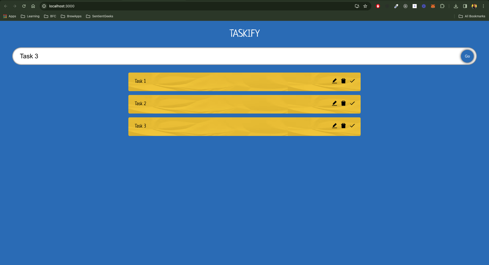

# Taskify 🚀

Welcome to Taskify, your ultimate companion for managing tasks efficiently! Taskify is a simple yet powerful to-do application built with React and TypeScript. With Taskify, you can organize your tasks effortlessly.

## Features

- **Add Tasks**: Quickly add new tasks to your list with a simple click.
- **Edit Tasks**: Modify your tasks on the fly to keep your list up-to-date.
- **Delete Tasks**: Say goodbye to completed or unnecessary tasks with ease.
- **Responsive Design**: Taskify adapts to any screen size, ensuring a seamless experience across all devices.
- **Intuitive UI**: Enjoy a clean and intuitive user interface for a hassle-free task management experience.

## Getting Started

To get started with Taskify locally, follow these simple steps:

1. Clone this repository to your local machine.
2. Install dependencies using `npm install`.
3. Run the development server with `npm start`.
4. Open your browser and navigate to `http://localhost:3000`.

## Tech Stack

Taskify leverages the following technologies:

- **React**: A powerful JavaScript library for building user interfaces.
- **TypeScript**: A statically typed superset of JavaScript that enhances code quality and developer productivity.
- **HTML/CSS**: Fundamental web technologies for structure and styling.

## Acknowledgments 🙏

- Shoutout to RoadsideCoder (https://www.youtube.com/watch?v=knqz3_rPcKk)

---

**Taskify** - Simplify Your Tasks, Elevate Your Productivity!
